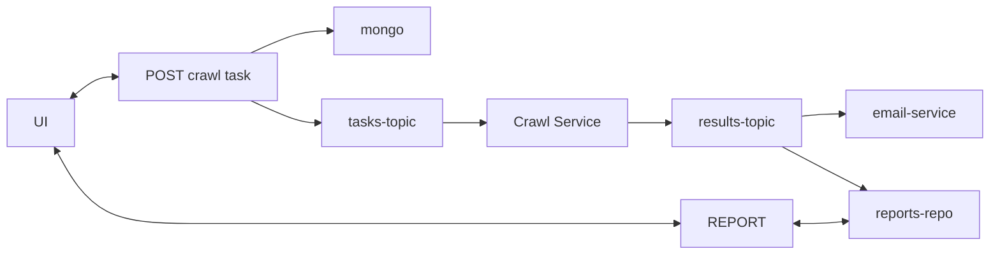

# Case Studies

### Crawler

 

- sbt run
- [API doc](http://localhost:9999/docs)

```mermaid
    flowchart LR
    
    CRAWL["POST crawl task"] --> mongo
    CRAWL --> tasks-topic
    REPORT <--> reports-repo
    
    tasks-topic --> SVC["Crawl Service"]
    SVC --> results-topic
    results-topic --> email-service
    results-topic --> reports-repo
    
    UI <--> CRAWL
    UI <--> REPORT
    
```
